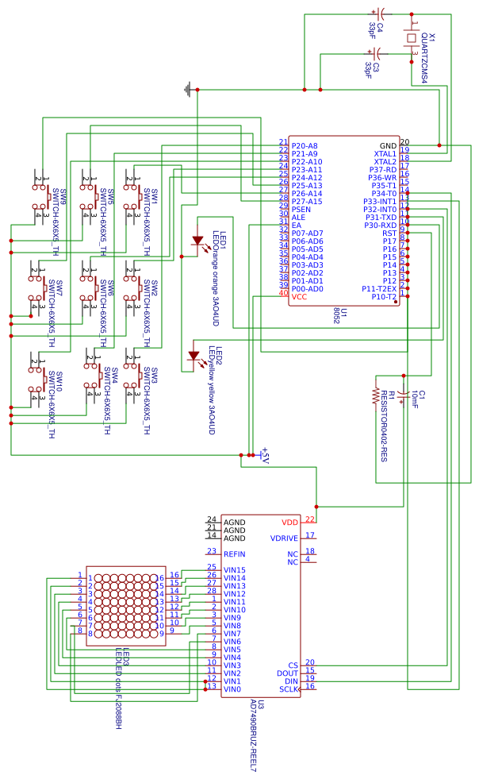
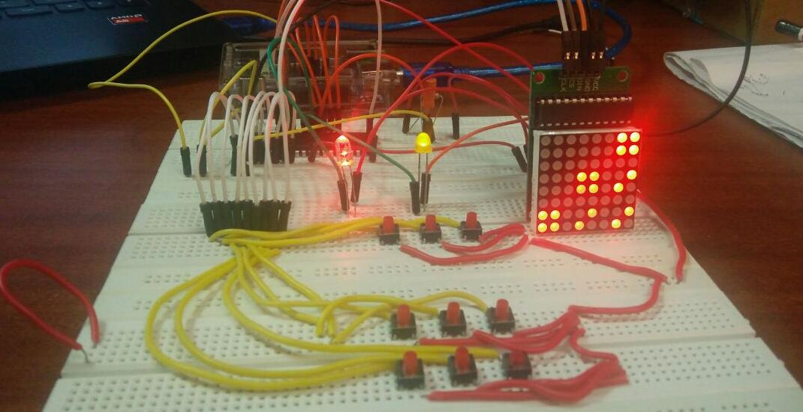

# TicTacToe
[TicTacToe](https://en.wikipedia.org/wiki/Tic-tac-toe) is a 2-player game written in embedded C for CSE2006 project. It runs on [Atmel AT89S52](https://www.keil.com/dd/docs/datashts/atmel/at89s52_ds.pdf).
### Hardware
-  AT89S52 microcontroller
-   LED Matrix
-   MAX7219 IC
-   SPI IC
-   Button grid for input
-   Breadboards, jumper cables and batteries
-   Arduino (as ISP)
 
The circuit looks like:

### Running
Flash the code onto the microcontroller using a programmer.  We followed [this blogpost](http://www.instructables.com/id/ARDUINO-AS-A-8051-PROGRAMMER/) and used Arduino as a programmer.

The buttons in the 3*3 grid act as an input and the visuals is shown on the LED matrix.

### Code
* MAX7219.C, MAX7219.h: driver for LED matrix
* game.c, game.h: game logic
* tictactoe.c: application entry point

### Look and Feel
The project looks like this!

### Contributors
[@anujanegi](https://github.com/anujanegi)
[@shubham1172](https://github.com/shubham1172)

Special acknowledgment to Randy Rasa for the LED driver.
